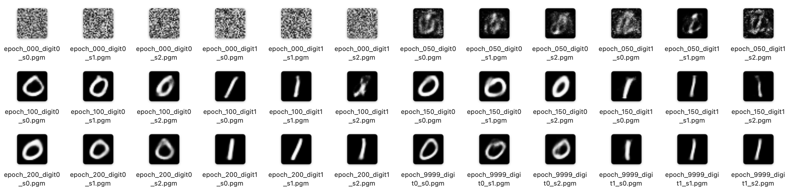
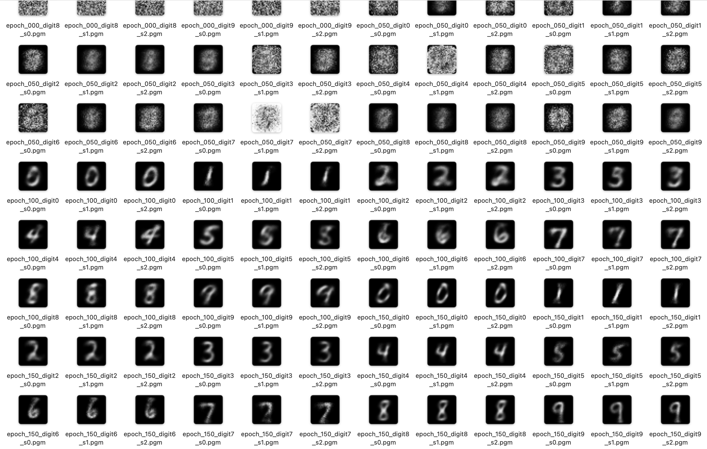

# MNIST Conditional VAE in C

A ground-up implementation of a **Conditional Variational Autoencoder (CVAE)** in C, trained on MNIST digits, with zero external dependencies beyond `libc` and `libm`.

**Author:** Ashwin Shirke

**Digits 0 & 1 (v1):**


---

## Motivation

This project is a deliberate exercise in understanding a generative model at its lowest level.

The starting point: *can I implement a VAE — the math, the training loop, the backpropagation — without hiding anything behind a library?*

Writing it in C means every design choice is visible and intentional. There is no automatic differentiation, no tensor abstraction, no GPU kernel. The matrix multiplies, the gradient accumulators, the Adam moment buffers, the reparameterisation trick — all written explicitly, readable in a single afternoon.

The secondary goal was to write that code at a standard that holds up under engineering review: strict module boundaries, a single-slab heap memory model, per-instance RNG with no shared mutable state, a numerical gradient check in the test suite, and endian-safe binary checkpoints.

---

## Quick Start

```bash
# 1. Download MNIST (one-time)
./scripts/download_mnist.sh

# 2. Train on digits 0 & 1
make
./exe/vae_model

# 3. Train on all 10 digits
make full
./exe/vae_model --full-mnist

# 4. Convert generated PGM images to PNG
./scripts/convert_to_png.sh

# 5. Run the test suite
make test
```

Training is fully resumable — checkpoints are saved to `models/vae_vN.bin` and reloaded automatically on restart.

---

## Models

| | v1 | v3 |
|---|---|---|
| Digits | 0 & 1 | 0 – 9 |
| Parameters | ~385K | ~406K |
| Architecture | 256→128→z32 | 256→128→z64 |
| Training time | ~30 min | ~90 min |
| Speed (serial) | ~1,500 img/s | ~1,400 img/s |
| Speed (OpenMP) | ~4,100 img/s | ~4,100 img/s |

Both models use the same hidden layer widths. v3 only doubles the latent dimension (32→64) to accommodate 5× more classes — no extra hidden capacity is needed.

---

## Build Targets

| Target | Description |
|---|---|
| `make` | v1 — digits 0 & 1 |
| `make full` | v3 — all 10 digits |
| `make omp-mini` | v1 with OpenMP (requires `brew install libomp`) |
| `make omp-full` | v3 with OpenMP |
| `make omp` | Both OpenMP variants |
| `make debug` | Debug build (`-g -O0`) |
| `make asan` | AddressSanitizer + UBSan |
| `make test` | Run all tests |
| `make tsan` | ThreadSanitizer (validate OpenMP) |
| `make clean` | Remove all build artifacts |

---

## Architecture

This is a **Conditional VAE**. The digit label is one-hot encoded and concatenated into both the encoder input and decoder input, so the model can generate a specific digit on demand.

```
 image (784) ─┐
              ├─→ Linear(ELU) → Linear(ELU) → μ, log σ²  [latent]
 label (nc)  ─┘                                    │
                                     z = μ + σ·ε  (ε ~ N(0,I))
                                                   │
 label (nc)  ─┐                                    │
              ├─→ Linear(ELU) → Linear(ELU) → Linear(Sigmoid) → x̂ [784]
 z (latent)  ─┘
```

**Loss (ELBO):**
```
L = BCE(x, x̂) / IMAGE_SIZE  +  β · KL(q(z|x) ∥ N(0,I)) / latent
```

β is annealed from near-zero up to 0.2 during training, giving reconstruction time to converge before the latent space is regularised. Getting β right is critical — values too small cause posterior collapse and broken generation.


**All 10 digits (v3):**


---

## Testing

```bash
make test
# ALL TESTS PASSED
```

The test suite covers: RNG determinism and distribution correctness, Adam convergence and gradient ownership contracts, forward pass determinism, loss finiteness, checkpoint roundtrip, backward pass correctness via **numerical gradient check**, and integration tests verifying loss decreases and KL annealing schedule correctness.

---

## References

- Kingma & Welling, [*Auto-Encoding Variational Bayes*](https://arxiv.org/abs/1312.6114) (2013)
- Higgins et al., [*β-VAE*](https://openreview.net/forum?id=Sy2fchgDl) — motivation for KL weighting and annealing
- LeCun et al., [MNIST database](http://yann.lecun.com/exdb/mnist/)

---

## Contributing

If you have recommendations or have spotted bugs, please raise a pull request. See [CONTRIBUTING.md](CONTRIBUTING.md) for details.
